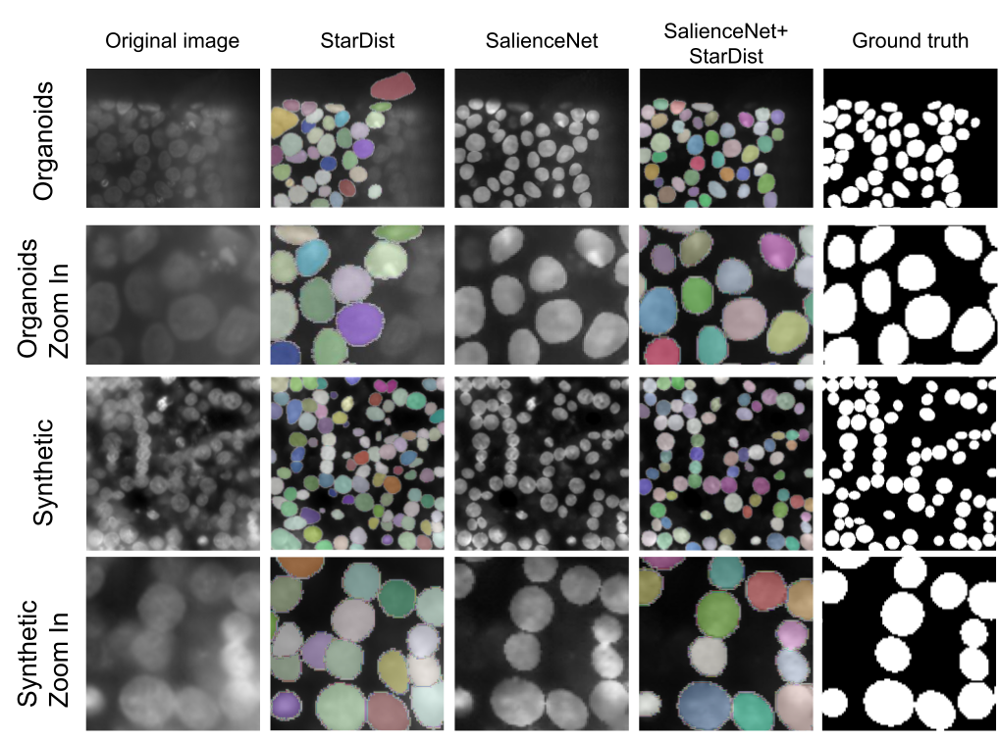

# SalienceNet

Deep Learning style transfert for nuclei enhancement



## Prerequisites
- Linux or macOS
- Python 3
- CPU or NVIDIA GPU + CUDA CuDNN

## Getting Started
### Installation

- Clone this repo:
```bash
https://github.com/ebouilhol/SalienceNet.git
cd SalienceNet
```

- Install [PyTorch](http://pytorch.org) and 0.4+ and other dependencies (e.g., torchvision, [visdom](https://github.com/facebookresearch/visdom) and [dominate](https://github.com/Knio/dominate)).
  - For pip users, please type the command `pip install -r requirements.txt`.
  - For Conda users, you can create a new Conda environment using `conda env create -f environment.yml`.


### Download pre-trained model
SalienceNet pre-trained model V0 is available on zenodo :
https://zenodo.org/record/7266921/files/salienceNet.zip?download=1

Once downloaded, move it to /SalienceNet/checkpoints and unzip it.

### Dataset
To create a dataset please use the following architecture : 
```bash

└── dataset_folder
    ├── testA
    ├── testB
    ├── trainA
    └── trainB
    
```
*A* being the source style dataset and *B* the target style dataset.

### Pretrained model
A pretrained model is available, to use it for prediction use the model name salienceNet :

```bash
#!./scripts/test_cyclegan.sh
python test.py --gpu_ids x --dataroot datasets/dataset_example/ --model cycle_gan --input_nc 1 --output_nc 1 --name salienceNet

```

### CycleGAN train/test

- To view training results and loss plots, run `python -m visdom.server` and click the URL http://localhost:8097.
- To log training progress and test images to W&B dashboard, set the `--use_wandb` flag with train and test scrip


- To train a new model:
```bash
#!./scripts/train_cyclegan.sh
python train.py  --gpu_ids x --dataroot datasets/dataset_example/ --n_epochs xxx  --model cycle_gan --gan_mode LSSSIMGRAD --name modelname --wcrit1 0.2 --wcrit2 0.2 --wcrit3 0.6
```
To see more intermediate results, check out `./checkpoints/maps_cyclegan/web/index.html`.
- Test the model:
```bash
#!./scripts/test_cyclegan.sh
python test.py --gpu_ids x --dataroot datasets/dataset_example/ --model cycle_gan --name modelname

```
- The test results will be saved to a html file here: `./results/maps_cyclegan/latest_test/index.html`.


## Acknowledgments
Our code is inspired by [pytorch-cycleGAN](https://github.com/junyanz/pytorch-CycleGAN-and-pix2pix).
For more information regarding the possible test and train option please refer to this github.
